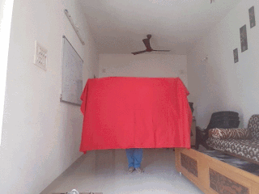

# Invisibility cloak tutorial

This tutorial aims at explaining some key concepts of `image processing` using `opencv` with python.
We will try to understand each line of the [code](AR_invisibility_Cloak.py)

> ###### Note for someone using python for the first time:
> anything written after '#' will be treated as a comment. 
> it is a good practice to add comments in your code. 
> It makes the code easy to understand.


### Importing all the required libraries

```python
import cv2
import numpy as np
import time
```

### Extracting the static background frame
Now as explained in the [readme](README.md), We will replace the current frame pixels 
corresponding to the cloth with the background pixels to generate the effect of
an invisibility cloak. For this we need to store the frame of a static background.

```python
# Creating an VideoCapture object
# This will be used for image acquisition later in the code.
cap = cv2.VideoCapture(0)

# We give some time for the camera to setup
time.sleep(3)

background=0
for i in range(30):
	ret,background = cap.read()

# Laterally invert the image / flip the image.
background = np.flip(background,axis=1)
```
>cap.read() method enables us to capture latest frame(stored in variable `background`) with the camera
>and it also returns a Boolean (True/False stored in `ret`). If frame is read correctly, it will be True. 
>So you can check end of the video by checking this return value.

###### Why capture background image using a for loop ?
As the background is static we can do with a single capture right ?
Well yes but the image captured is a bit dark compared to when 
multiple frames are captured. 
Hence capturing multiple images of static background with a for loop
did the trick for me.


### Understanding the while loop
`cap.isOpened()` Returns true if cap is initialized.
Just like we got the frames for background we try to recieve 
current frames in the while loop using `ret, img = cap.read()`
and then flip the image using `img = np.flip(img,axis=1)`.

#### Extracting red colour in the image.
So the idea is that we will use a red colour cloth as out invisibility cloak.
We will first determine the region covered by the cloth (`determine pixels corresponding to red colour`).
To detect red colour we use the HSV colour space. 

We convert the image into HSV colour space using the following line of code.
```python
img_hsv=cv2.cvtColor(img, cv2.COLOR_BGR2HSV)
```
Using HSV(Hue-Saturation-Value) colour space we can distinguish 
between different colours much accurately than we can in RGB colour space.

###### Setting range of HSV values for red colour detection
Below code is used to detect pixels corresponding to the red colour cloth.
```python
# Range for lower red
lower_red = np.array([0,120,70])
upper_red = np.array([10,255,255])
mask1 = cv2.inRange(hsv,lower_red,upper_red)

# Range for upper range
lower_red = np.array([170,120,70])
upper_red = np.array([180,255,255])
mask2 = cv2.inRange(hsv,lower_red,upper_red)
```
Hue range | 0-10 | 170-180
---|---|---

>The Hue values actually range between 0-360 degrees but
>in OpenCV to fit into 8bit value the range is from 0-180.
>Red colour is represented by 0-10 and 170-180 values.


Saturation range | 120-255
---|---
> Saturation represents purity of colour. Pure Red, Green and Blue
>are considered to be true saturated colours. As saturation decreases the effect of the other two
>colour component increases.
> Here we set the above value because our cloth is of highly saturated red color.

Value range | 70-255
---|---
> Value corresponds to the brightness of the image. For a given pixel if the value is increased or 
> decreased then values of R,G and B will increase or decrease respectively but their percentage 
>contribution will remain unchanged.
> The lower value of the range is 70 so that we can detect red colour in the wrinkeles of the cloth as well.

Now we understand why we need to convert to HSV colour space.


The below command returns an array with pixel value = 255  for pixels 
having HSV values within upper and lower value range and 0 otherwise.
This way we generate a mask.
```python
mask = cv2.inRange(img_hsv, lower_red, upper_red)
```

And finally we `OR` both the masks (mask0 and mask1) to get 
our final mask. 
```python
mask = mask0 + mask
```
This is also a simple example of operator overloading of `+`.

`mask = cv2.morphologyEx(mask, cv2.MORPH_OPEN, np.ones((5,5),np.uint8))` This line of code
removes small regions of false detection which will avoid random glitches in the final output.


##### Here's the trick !!
`img[np.where(mask==255)] = background[np.where(mask==255)]`
What we do in this line is quite simple. We access all the pixels which have value of 255 
in the final mask (`The pixels corresponding to the detected red colour`), and we replace the pixel values 
with the pixel values of respective coordinates in the background frame. That's the trick. 
View the gif Pictures to understand what is happening. 

 

